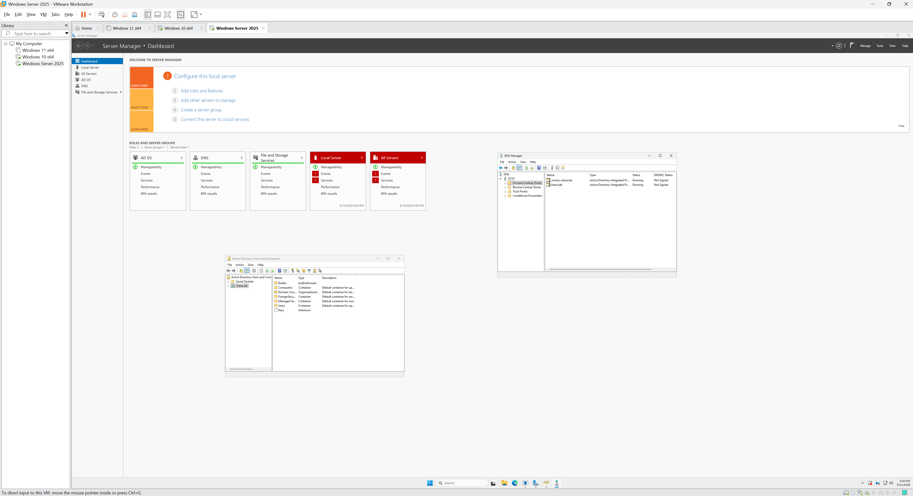
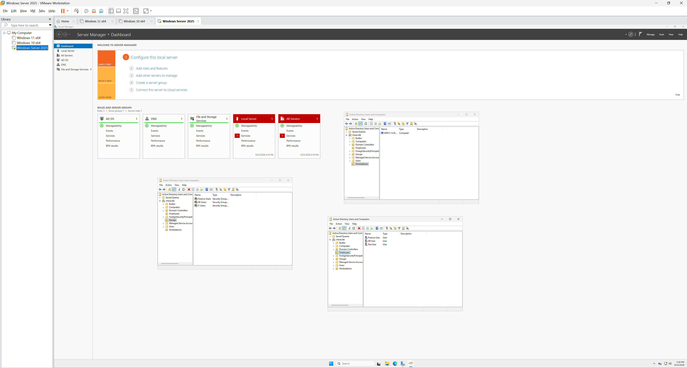
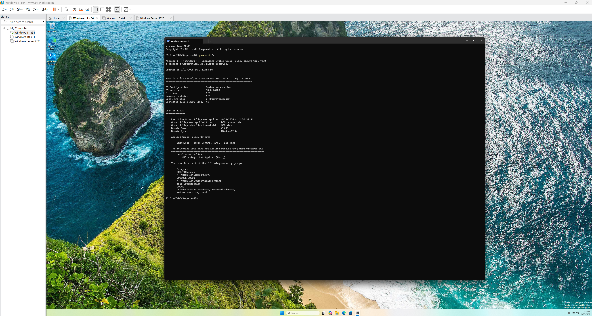
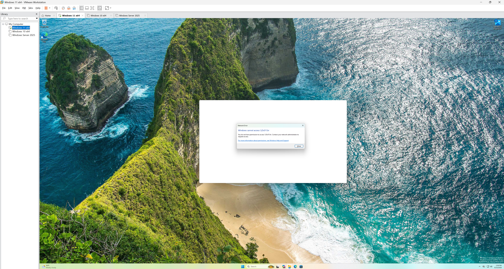

# Home IT & Cybersecurity Lab

### Week 1 Building Foundation

This repository documents my first hands on home lab as I learn IT administration, networking, Active Directory, and cybersecurity.

I am building the environment in VMware Workstation and documenting what I learn as I go.

## Lab Environment

- VMware Workstation Pro
- Windows Server 2025
- Windows 10 Pro
- Windows 11 Enterprise

## What I've Completed

- Created Windows 10, Windows 11, and Windows Server virtual machines
- Configured a static IP address for my Windows Server
- Installed Active Directory Domain Services (AD DS)
- Installed and configured DNS
- Created my first Active Directory domain: `chase.lab`
- Installed RSAT tools on Windows 10
- Configured Windows 10 to communicate with the domain controller
- Practiced DNS and Active Directory connectivity testing

## Currently Learning

- Connecting Windows client machines to Active Directory
- Managing Active Directory users and groups
- Organizational Units (OUs)
- Group Policy
- File and folder permissions
- Windows administration and troubleshooting

## Lab Progress

This is my first time building an environment like this. I am documenting the process to reinforce what I learn and track my progress as I gain more hands-on experience.

## Lab Screenshot

This screenshot shows my VMware lab running Windows Server 2025 alongside Windows 10 Pro and Windows 11 Enterprise. I configured Active Directory Domain Services and DNS and created the `chase.lab` domain as part of my first hands-on Active Directory lab.

---

### Week 2 — Active Directory Administration & Permissions

This week I started using the domain more like a real business environment by creating users, groups, policies, and department-based access controls.

#### What I Completed

- Joined Windows 10 Pro and Windows 11 Enterprise to the `chase.lab` domain
- Created `Employees`, `Groups`, and `Workstations` Organizational Units
- Created domain users for IT, Finance, and HR
- Created Global Security groups for IT, Finance, and HR
- Added users to their correct department security groups
- Moved `WIN11-CLIENT01` into the `Workstations` OU
- Successfully logged into Windows 11 using an Active Directory domain account
- Created and applied my first Group Policy
- Verified the policy on the Windows 11 client using `gpresult /r`
- Created network shares for IT, Finance, and HR
- Configured Share permissions and NTFS permissions
- Verified department users could create, edit, and delete files in their own shares
- Verified unauthorized users received Access Denied when attempting to access other departments

#### What I Learned

- How Organizational Units help organize Active Directory
- The difference between users, OUs, and security groups
- How Global Security groups can control access to resources
- How Group Policy can centrally manage domain users
- How to verify an applied Group Policy with `gpresult /r`
- The difference between Share permissions and NTFS permissions
- How multiple permission layers work together to restrict department resources

#### Screenshots

**Active Directory structure**

**Group Policy applied to the Windows 11 client**

**Unauthorized department access correctly denied**

